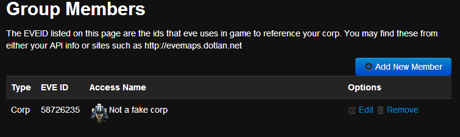
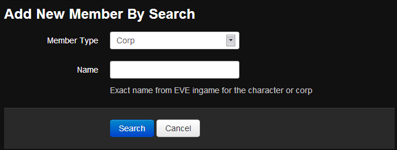
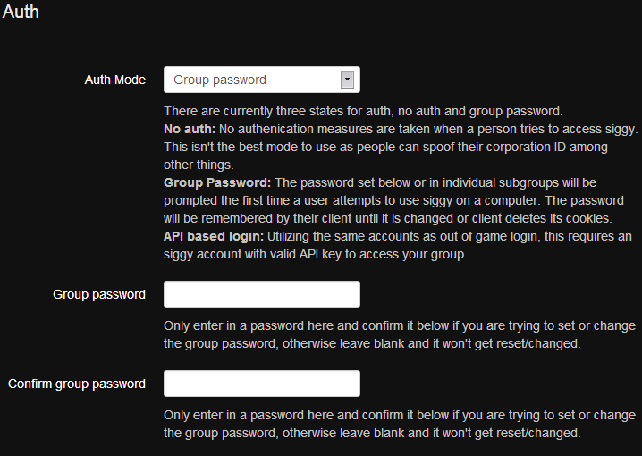
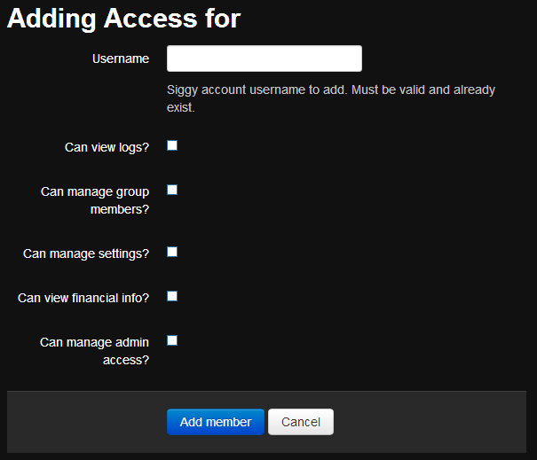
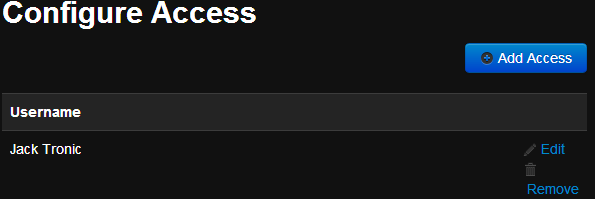

## Basic Setup

### Group Members
In order to provide access to characters and corporations, you must add group members at Group Access > Group Members.

Click the Add New Member button to be taken to the search form

Select the member type of either Corporation or Character and fill in the name. Click Search to continue. The EVE API is used to locate the entity so exact names are preferred.
### Important Settings

#### Auth

One of the most important settings is the auth settings.

By default the auth mode is **No Auth**. This means the ingame browser data is not verified when it reports it is a character and corporation member but this data can be faked. The protection against someone getting access they shouldn't is the **Group Password**. The group password is a global password that users must enter to get access. You can change the group password anytime and all users will be forced to login again.

A greater level of security is **API Login** but this requires registering accounts and entering blank API keys(no permissions required).
### Payment

You will be billed within 24 hours for usage. You must deposit a isk balance to get your account in the green.

See [Billing & Payment](billing-payment.md) for more details

### Additional Managers
You can have an unlimited number of group managers. The settings are found at Group Access > Management Access. There is a permission system to restrict what a user may do.

It is suggested that if you are a sizable corp or alliance that you add at least one more person to management. All the person needs is a siggy account registered, they do not have to enter an API key. Then just submit their username on the form to register.
