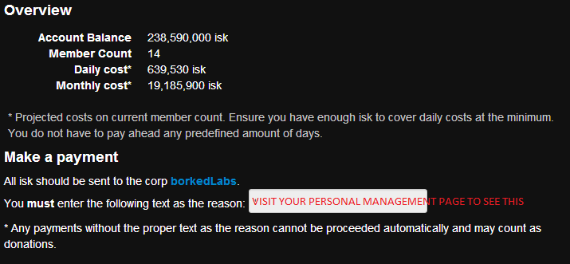

### Billing
siggy uses a balance system where you deposit isk in advance of usage. Billing is done every 24 hours. A daily usage charge is deducted from your balance every day. The costs can be found on http://siggy.borkedlabs.com/pages/costs . The costs scale with group member count. Group member count is based on the number of characters in corporation, the data is API pulled every day and will be relatively up to date. Individual characters also add +1 to the count each.

The billing overview page provides the account balance and the estimated daily cost and monthly costs at the current member count levels.

** DO NOT SUBMIT PAYMENT WITH THE CODE IN THE ABOVE PICTURE, YOU MUST USE THE CODE IN YOUR SIGGY GROUP MANAGEMENT PAGE.
**

### Payment

Payment is automated via EVE API.

ISK is deposited to the borkedLabs corporation with the reason code provided on the overview page.

### FAQ
  - Most of my corp is alts, can I be charged less?
If you would like to be charged less, you must add characters individually as group members instead of the entire corporation. It would be unfair and too arbitrarily to start giving discounts with no way to validate claims of alts.
  - I submitted payment but it hasn't been credited yet to my account, what do I do?
Because payments are on an automated system, they are only processed every hour. Due to API caches it will normally take up to 2 hours but can be longer if the API system is down. If payment does not show up after 24 hours please get in touch for help [[support|support]]
  - Do I have to use the reason code?
Yes, the reason code is absolutely required. Invalid reason codes will not get credits applied.
  - Help! I forgot the reason code.
Send an EVE mail per  [[support|contact]] instructions with the transaction time from your wallet and the reason code you forgot.
  - Can I get a refund?
Sure, just get in touch via details provided on the [[support]] page.
