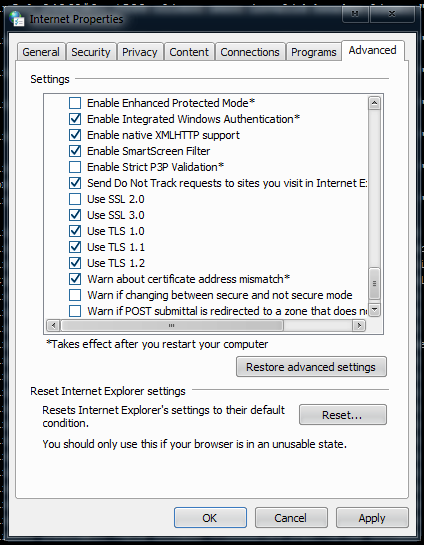

If your IGB returns -101 Connection Reset or siggy tells you the connection is insecure then this help page is for you!

Your computer may have had it's security downgraded by something malicious or Windows just defaulted to something broken.

Open your Control Panel, Internet Properties, Advanced Tab.

Scroll down the list on the page until you reach "Security".

You want to enable Use TLS 1.0.

Also enable Use TLS 1.1 and Use TLS 1.2 if available but they might not be there depending on OS but you need at least TLS 1.0.

DO NOT ENABLE Use SSL 2.0 IF ITS NOT ENABLED. IT IS A OLD AND WEAK SECURITY PROTOCOL.

You will have to restart the EVE IGB and/or Internet Explorer after changing the settings.

