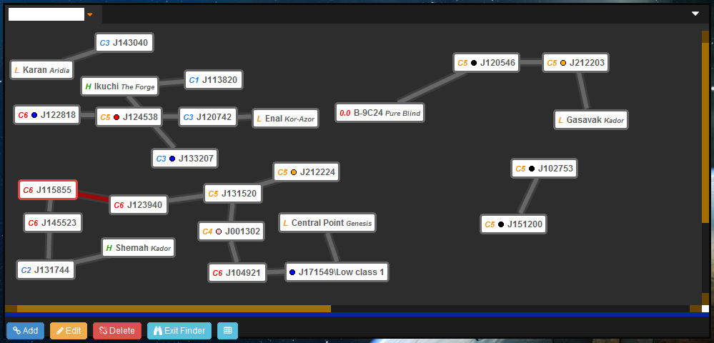
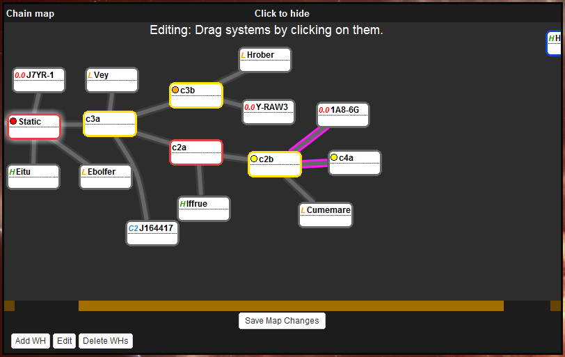
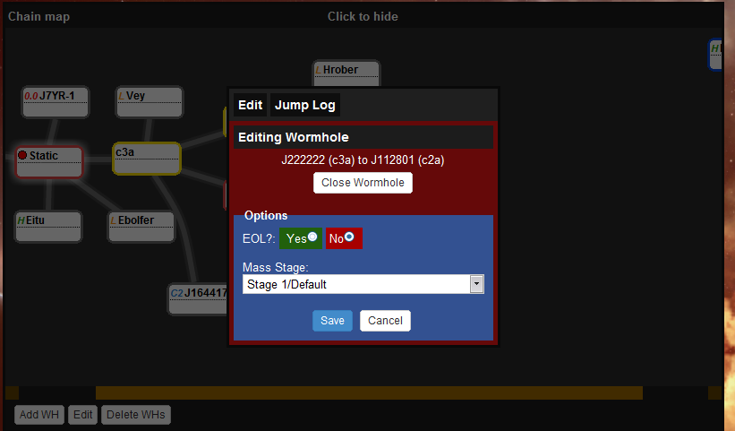
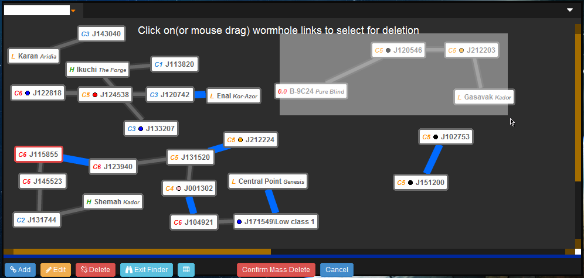
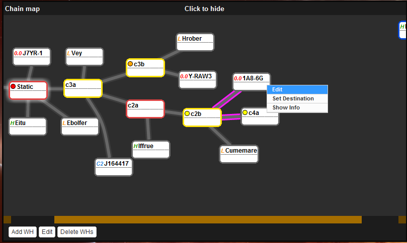
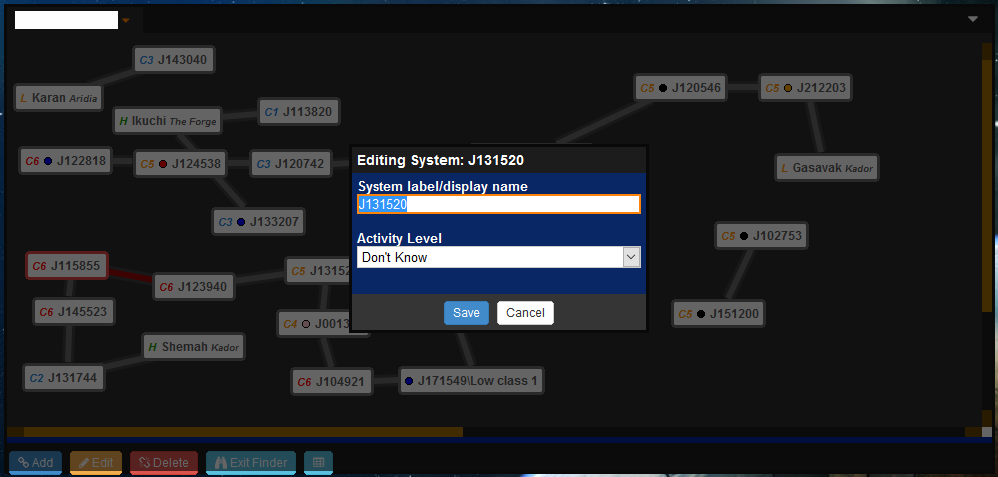

## Introduction

The chain map is the main navigation aid. It allows pilots to create a chain map that will visibly show all systems, their "status" based on scouting and where they lead. Additionally custom names allow use of any chain naming convention desired.

### Map Legend
#### Wormholes
  * ** Pink outline ** End of life
  * ** Grey filling ** Wormhole is still stage 1 in mass
  * ** Yellow filling ** Wormhole is reduced mass
  * ** Red filling** Wormhole is critical

####Systems
  * ** Grey border** Default/unknown system status
  * ** Blue border** Friendly system
  * ** Yellow border** Occupied system
  * ** Green border** Empty/clear/safe system
  * ** Red border** Actives/hostiles in system
### Mapping Systems

Wormholes can be mapped in two ways:
  - Automatic - Systems will automatically map when you jump between systems. The only limitation is it cannot handle kspace to kspace jumps due to stargates.
  - Manual - Systems can be connected manually. There are no restrictions on the systems.

### Editing The Map

Editing the map is simple. Simply click the Edit button and you will be able to drag systems when you click on them. Click Save to commit the changes.

### Wormholes

#### Options

Wormholes between systems have two options that can be set:

**EOL?** Sets whether the wormhole is EOL or not on the map. EOL wormholes show up in pink. Additionally, the time the wormhole is set EOL is recorded and can be seen by hovering over the connection on the map.

**Mass Stage** Sets the wormhole mass stage, i.e. Healthy, Reduced, and Critical (or whatever your group may call these stages). The color of the wormhole connection changes in response on the map.

These options can be opened by simply clicking on a wormhole on the map.

#### Deletion

Two options exist to delete wormholes, one method is to click on a wormhole and click the Close Wormhole button. The second option is to click the Delete WHs button on the bottom bar. This activates a mass delete mode. You can click on multiple wormholes to select them(they turn blue), you can also click them again to deselect. Click-drag will also let you select wormholes within the selection box.

Click Confirm to process the deletion or Cancel to stop the process.

### Systems

Systems on the have a right click menu to bring up three extra options.

  * **Edit** Let's you edit the system, see below
  * **Show Info** Open's the ingame showinfo or dotlan out of game
  * **Set Destination** Set's your ingame destination to that system
#### Editing Systems

Systems come with options to set:

  * **Display Name** This is the name that will be visible on the chain map and the info section below the map. This can be anything and in any language(unicode supported).
  * **Activity Level** The current activity level that was seen by scanners/scouts

