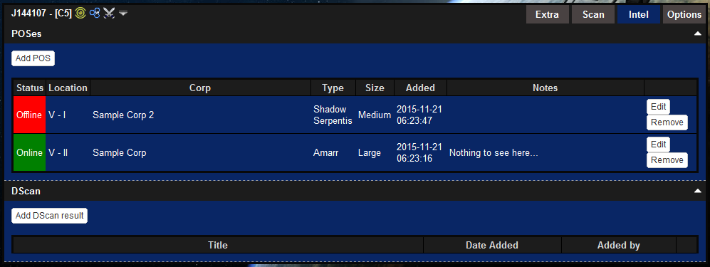
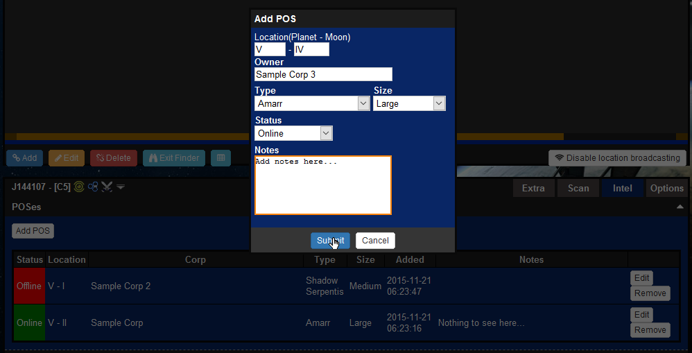
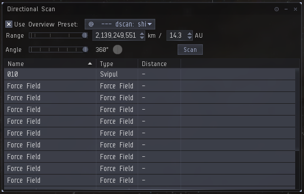
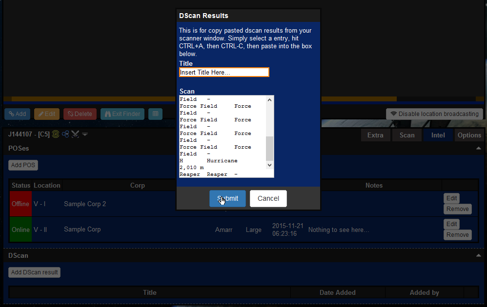

# Intel

The intel section provides options to add system direction scan results and POS intel. This can be accessed in the "Intel" tab as shown in the following image:

## POS Locations

The POS location section provides the ability to assign POS locations to a particular system.

To add a new POS:

1. Click the "Add POS" button.

2. Fill in the entries, only "Status", "Location", "Type" and "Size" are required.

3. Hit "Submit".

## Directional Scan

The DScan section provides the ability to paste directional scan results into siggy.

To copy direction scan results from the in-game dscan window:

1. Click on a dscan result in your dscan window.

2. Hit CTRL+A to select all results, hit CTRL+C to copy.

To paste dscan result into siggy:

1. Click the "Add DScan Result" button.

2. Add a title and paste your result into the "Scan" box using CTRL+V.

3. Hit "Submit".
