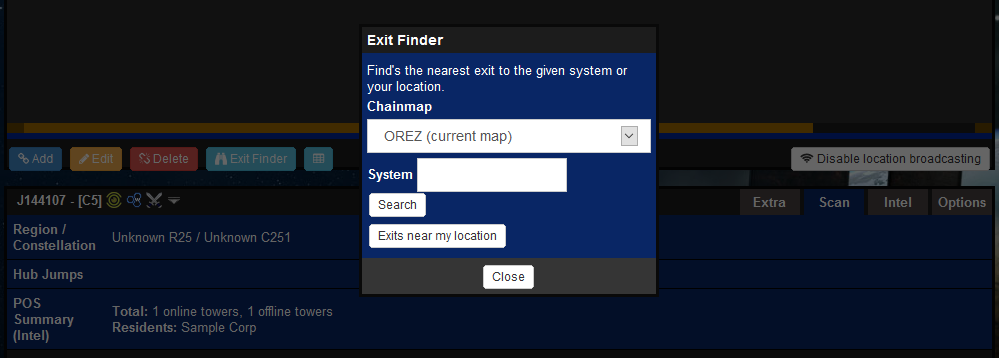
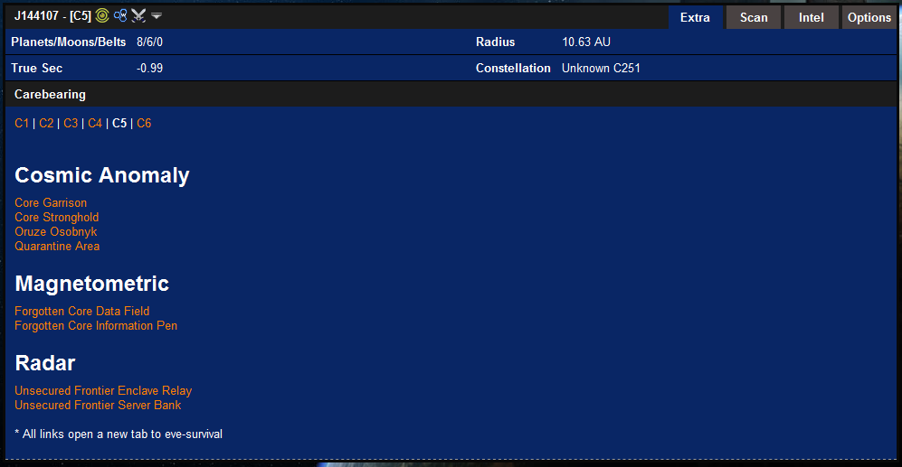
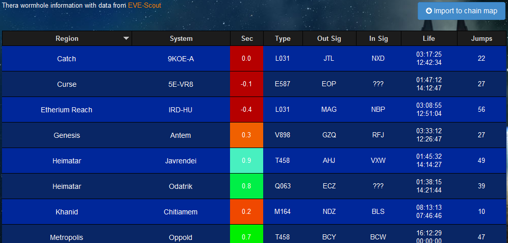
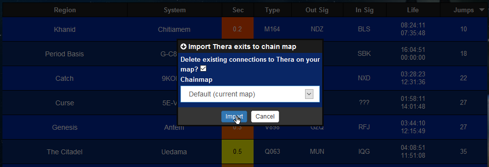
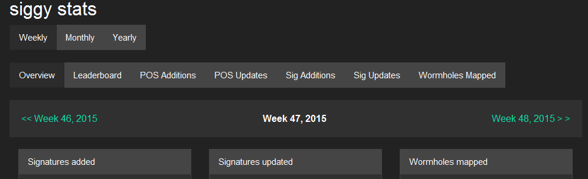

# Other Features

## Exit Finder

The exit finder will locate the nearest k-space wormholes to a selected location or your location.

To use this feature:

1. Click the "Exit Finder" button.

2. Select which chain map to search for an exit.

3. Enter your target system that you need an exit towards into the system entry field. (alternatively hit "Exits near my location").

4. Hit "Search"

## Extra Infomation

The "Extras" tab gives access to extra information about the selected system on siggy.

It gives details of the system such as True Sec and Radius, as well as providing links to the corresponding EVE-survival pages on the anomalies within the system.

## Thera

The "Thera" page provides information on the latest connections to the wormhole system Thera. It can be accessed through the drop down menu on the top left. The wormhole data is imported from [EvE-Scout](http://www.eve-scout.com/).

Clicking on the systems gives three extra options:

* **Set Destination:** Sets your destination to the selected system.

* **Show Info:** Opens the in-game information window.

* **DOTLAN:** Opens the DOTLAN page of the selected system.

Scrolling over the wormhole type also gives information of the mass, max jumpable mass and max lifetime.

To import the Thera connections onto a chain map:

1. Click the "Import to chain map" button.

2. Select the destination chain map.

3. Check whether to delete existing connections to Thera.

4. Hit "Import".

## Notifications

Notifications can be accessed through the drop down menu on the top left. Notifications provide the ability to get notifications on the siggy dropdown under the following conditions:

* **System mapped:** When a target system or a system within some jumps of the target system is mapped by jump.

* **Resident found:** When a system with target residents is mapped by jump.

* **Site found:** When a signature of a target site is mapped.

The scope of the notifications can be set to "Personal" or "Group".

## Stats

Siggy stats gives an overview of general individual activity over a period of time and can be accessed through the drop down menu on the top left.

