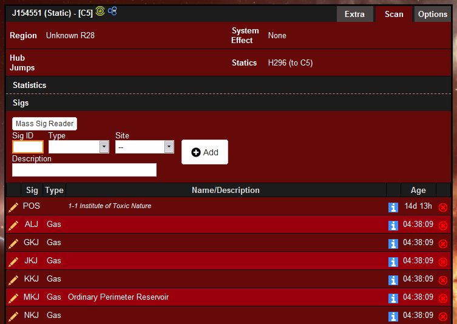
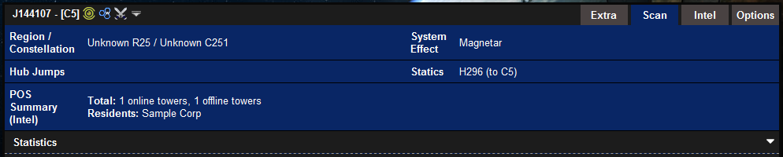
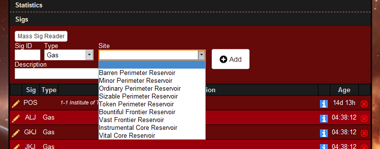
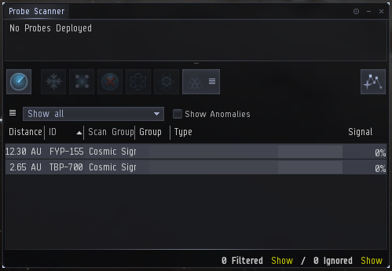
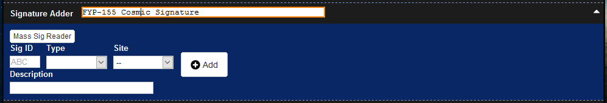
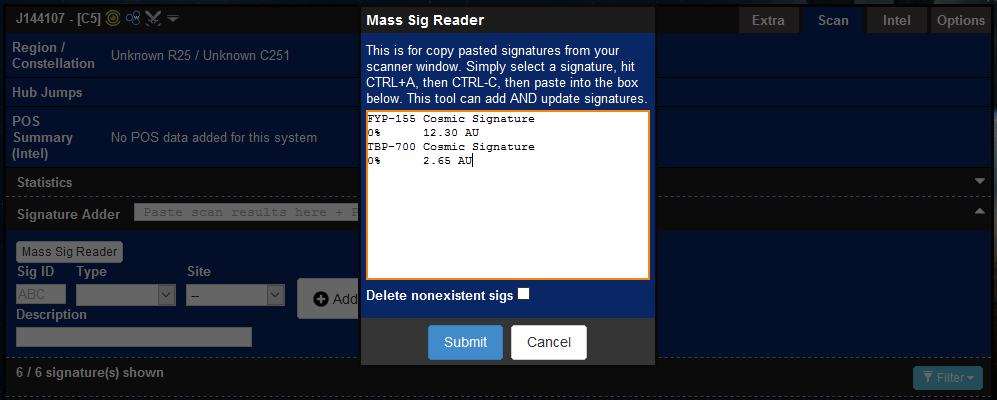
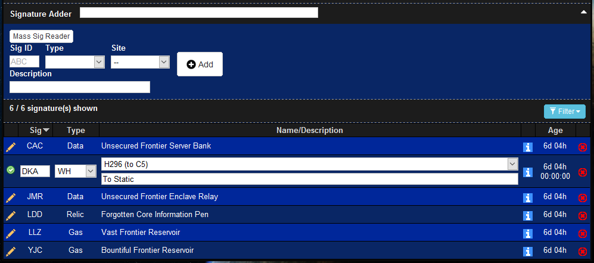
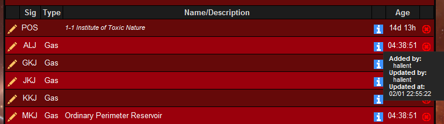

# Sigs

Signatures (sigs for short) are your scanner results. Sigs are recorded in the "Scan" tab of siggy as shown in the following image:

Sigs table contains columns for:

  * **Sig:** The first three letters of the signature ID from the scan results in the in-game probe window.

  * **Type:** The signature type: Wormhole (WH), Gas, Data, Relic, Ore, Combat.

  * **Name:** The exact name of the signature, includes all sites and wormhole connections.

  * **Description:** A text field available to enter any desired descriptive text such as "return wh" or "site completed", etc (as seen in DKA).

  * **Age:** An automatic time counter starting from when the sig was first added. Additional estimated time left on wormhole signatures.

## Scan Summary

The "Scan" tab contains a short summary of the system information.

The summary provides the following information:

  * **Region / Constellation:** The region and constellation for the selected system.

  * **Hub Jumps:** The number of jumps (if k-space system) to Jita, Amarr, Dodixie, Hek and Rens.

  * **POS Summary (Intel):** A summary of the intel page, including the number of online and offline towers and the residents.

  * **System Effect:** The wormhole system effect (if w-space system).

  * **Statics:** The static connection of the wormhole (if w-space system).

## Adding Sigs

There are three methods to add signatures to the sig table and can be done in the section above the sig table. You may add as many signatures as you like, there is no limit.

### Individually Adding Sigs

Signatures can be individually added simply by filling in the blank fields, selecting options from the dropdown and pressing the "Add" button. The only piece of information required is "Sig ID", all other fields are optional.

### Signature Adder

Signatures can also be added through the "Signature Adder" entry field in conjunction with the in-game probe window.

To copy sigs from the probe window:

1. Click on a signature in your scanner window.

2. Hit CTRL+A to select all the signatures, hit CTRL+C to copy.

To add signatures using signature adder:

1. Paste the selection into the signature adder.

2. Hit enter.

### Mass Sig Reader

Signatures can be mass added and updated through the use of the "Mass Sig Reader".

To use this feature:

1. Follow the steps above to copy signatures from the probe window.

2. Click on the "Mass Sig Reader" button to open the entry box.

3. Click on the entry field and CTRL+V to paste into the box.

4. Check the delete nonexistent sigs box if applicable.

5. Press Submit.

Signatures should be added or updated within 10 seconds.

## Editing Sigs

Click the pencil icon on the far left of a signature in the table to edit it. You can change all the fields of a signature just like adding it.

Editing will preserve the time the signature was added to make tracking wormhole timers more convenient.

## Deleting Sigs

Deleting a signature is done by clicking the corresponding "X" next to the sig. This will instantly delete the signature.

## Extra Information

The "Info" icon next to each signature provides information on the time the signature was added and the name of the user who added it.

